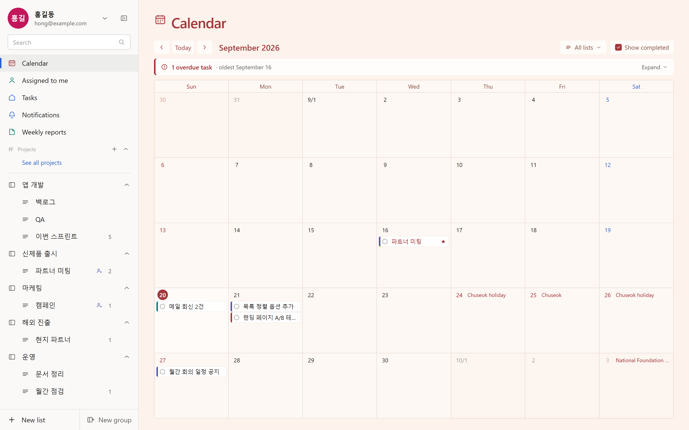
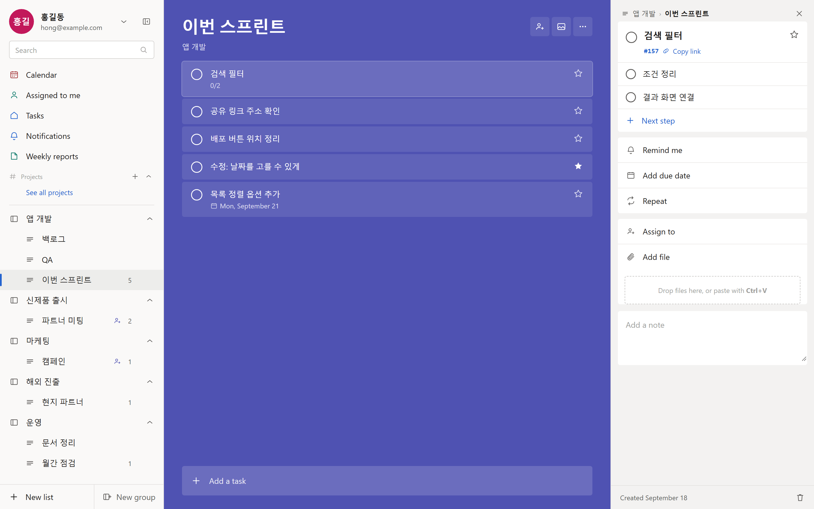
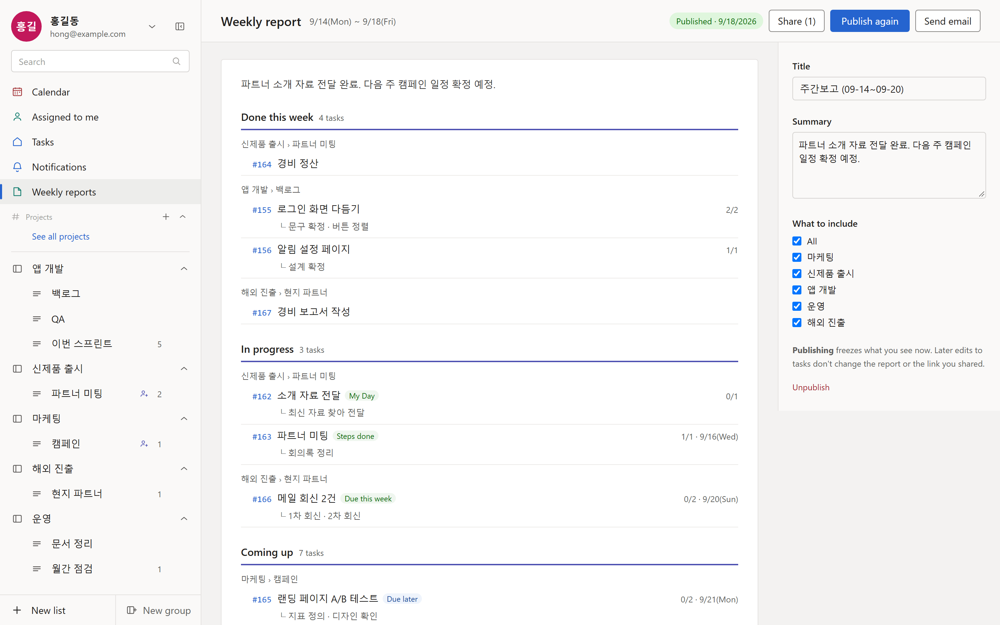

# open-todo

A self-hosted task manager for small teams: shared lists and groups, a calendar, project
channels for conversation, and weekly reports that build themselves from the work you did.
Korean and English, per-person time zones. One install = one team; there is no tenancy,
no cloud account and nothing phones home.

Built with Next.js 16, React 19, Prisma 7 and PostgreSQL. MIT licensed.

[한국어 README](README.ko.md)



## What you get

- **Tasks** — lists inside groups, steps, due dates, reminders, repeats, importance,
  attachments and notes. Share a list or a whole group with someone as viewer, editor or
  admin. Assign work and it shows up under *Assigned to me*.
- **Calendar** — everything with a due date, month by month, with public holidays. Drag a
  task to another day.
- **Projects** — a conversation channel per project, with threads, @mentions, files and
  unread marks. Projects can be open to everyone on the install or invite-only.
- **Weekly reports** — one click collects the week's work into *Done this week*, *In
  progress* and *Coming up*, grouped by list. Edit, publish (which freezes a snapshot),
  share the link, or send it by email as HTML plus a PDF — now or at a scheduled time.
- **Notifications** — reminders, due-today, assignments and mentions, plus an optional
  morning digest sent at 8am in each person's own time zone.
- **Sign-in** — email and password, and optionally Google. Kakao and NAVER are on the way.
- **Administration** — sign-up policy, invitation links, people (make admin, disable,
  issue a reset link), and the name of the install.

| Tasks and details | Weekly report |
|---|---|
|  |  |

## Quick start with Docker

One container holds everything: the app, its PostgreSQL, and the scheduled jobs. One volume
holds everything that has to survive an upgrade: the database, the attachments and the
generated session key.

```bash
docker run -d --name todo \
  -v todo-data:/data -p 3000:3000 --shm-size=256m \
  -e APP_BASE_URL=https://todo.example.com \
  ghcr.io/wittbox/open-todo:latest
```

`APP_BASE_URL` is the address people will type; email links and OAuth callbacks are built
from it. That is the only value you have to set — the first boot creates the database,
applies the migrations and writes a session key into the volume.

Or from a clone, which builds the same image and reads `.env`:

```bash
git clone https://github.com/wittbox/open-todo.git
cd open-todo
cp .env.example .env     # set APP_BASE_URL
docker compose up -d --build
```

Put an HTTPS reverse proxy in front (see below) and open your address.

**Create the administrator account before anyone else can.** On an empty install the first
person to sign up becomes the administrator, and that door then closes for good. On a
server reachable from the internet, set `ADMIN_BOOTSTRAP_EMAIL=you@example.com` in `.env`
before you start it: only that address can claim the first account. While no administrator
exists, the server repeats a warning in its log.

After that, `/admin` decides who else may join:

- **Invite only** (the default) — administrators create invitation links.
- **Allowed email domains** — anyone who confirms an address at those domains can sign up.
- **Anyone** — open sign-up. People search then needs the full email address instead of a
  name fragment, so nobody can enumerate your users.

## Email

Sign-up confirmation, password reset, invitations, the morning digest and report mail all
go through SMTP. Any server works — your company's, Gmail with an app password, SES,
Mailgun, Postmark:

```bash
SMTP_HOST=smtp.example.com
SMTP_PORT=587                       # 465 = TLS from the first byte; others must do STARTTLS
SMTP_USER=todo@example.com
SMTP_PASS=…
MAIL_FROM="open-todo <todo@example.com>"
```

Check it with `npm run mail:test -- you@example.com` from a clone — the test script needs
the development dependencies, which the image does not carry.

Report mail is always sent **from** the install's address with the author's name as the
display name, and replies go to the author. Sending as the author's own address would fail
SPF and DMARC at the receiving end.

Without a mail server the app still runs: administrators hand invitation and password-reset
links over themselves, and the app says so on the screens where it matters. It will not
silently drop mail — in production, sending fails loudly instead.

## Sign in with Google

Optional. Google Auth Platform → create an app → OAuth client ID (web) → add the redirect URI
`{APP_BASE_URL}/auth/google/callback`. Put the two values in `GOOGLE_CLIENT_ID` and
`GOOGLE_CLIENT_SECRET`; the button appears once both are set. While the app is in Google's
*testing* status only the test users you list can sign in — publish it for everyone else.

**Kakao and NAVER** are not available yet. The code for them is in the repository, but it
hasn't been through a real sign-in with either service, so it stays switched off: setting
their keys shows no button, and the server logs that at startup.

Provider tokens are used once and thrown away; nothing is stored. An existing account is
never linked automatically — sign in the old way first, then connect the provider in
*Settings*, so that nobody can take over an account by controlling an address at a
provider.

## Environment variables

Inside the container the database, the upload directory and the scheduled jobs are already
wired up; these are what you can change.

| Variable | Required | What it does |
|---|---|---|
| `APP_BASE_URL` | yes | Public address. Email links and OAuth callbacks are built from it, and `https://` here is what turns on `Secure` session cookies. |
| `SESSION_SECRET` | | Signs session cookies. 32+ characters. Generated into `/data/secrets` on first boot if you leave it empty. Changing it signs everyone out. |
| `APP_NAME` | | What the install is called in titles and email. An administrator can also set it in `/admin`, which wins. Default `open-todo`. |
| `ADMIN_BOOTSTRAP_EMAIL` | | Restricts the first-administrator sign-up to one address. |
| `DEFAULT_LOCALE` | | `ko` or `en`, for people who haven't chosen. Default `ko`. |
| `APP_TZ` | | IANA time zone for people who haven't chosen, e.g. `Europe/Berlin`. Default `Asia/Seoul`. |
| `HOLIDAY_REGION` | | `kr` or `none`. Default `kr`. |
| `TRUST_PROXY` | | Number of reverse proxies in front (usually `1`). Only then is `X-Forwarded-For` trusted for rate limits. |
| `SMTP_HOST` `SMTP_PORT` `SMTP_SECURE` `SMTP_USER` `SMTP_PASS` `MAIL_FROM` | | Mail server. Without `SMTP_HOST`, production refuses to send. |
| `REPORT_MAIL_MAX_RECIPIENTS` | | Recipients per report send. Default 10. |
| `REPORT_MAIL_DAILY_LIMIT` | | Recipients per person per 24 hours. Default 100. |
| `GOOGLE_CLIENT_ID` `GOOGLE_CLIENT_SECRET` | | Sign in with Google. |
| `MOCK_MAIL` | | `1` writes mail to `tmp/mail/*.html` instead of sending. Development only. |
| `RUN_JOBS` | | `0` turns off the scheduler inside the app, for installs that drive `/api/cron/*` from outside. On by default in the container. |
| `CRON_KEY` | | Key for `/api/cron/*`, only needed with `RUN_JOBS=0`. Those endpoints answer `404` while it is unset. |
| `APP_PORT` | | Host port `docker-compose.yml` publishes. Default 3000. |
| `DATABASE_URL` `DATABASE_POOL_MAX` `UPLOAD_DIR` | | Local development outside the container. The image sets its own. |

The app checks these when it starts and writes a `[setup]` line for anything missing or
suspicious — read the log once after your first boot.

## Behind a reverse proxy

Terminate HTTPS in front of the app and forward the original host and scheme. Caddy:

```caddy
todo.example.com {
	reverse_proxy 127.0.0.1:3000
}
```

nginx:

```nginx
server {
	listen 443 ssl http2;
	server_name todo.example.com;

	client_max_body_size 25m;   # attachments

	location / {
		proxy_pass http://127.0.0.1:3000;
		proxy_set_header Host $host;
		proxy_set_header X-Forwarded-Proto $scheme;
		proxy_set_header X-Forwarded-For $proxy_add_x_forwarded_for;
		proxy_set_header X-Forwarded-Host $host;
	}
}
```

Then set `TRUST_PROXY=1` so sign-in rate limits see the visitor's address rather than the
proxy's, and make sure `APP_BASE_URL` matches the address people actually type — server
actions reject requests from another origin.

## Scheduled jobs

Some work has to happen while nobody is looking, and the app runs it itself:

| Job | How often | What it does |
|---|---|---|
| `tick` | hourly | Reminders, due-today notifications, the 8am digest in each person's time zone, and cleaning up used links. |
| `sends` | every 5 minutes | Report mail that was scheduled for later. |

There is nothing to configure. If you would rather drive them from outside — a cron on the
host, a Kubernetes CronJob — set `RUN_JOBS=0` and a `CRON_KEY`, and knock on the two
endpoints, which answer `404` while that key is unset:

```cron
*/5 * * * * curl -fsS -X POST -H "x-cron-key: $CRON_KEY" https://todo.example.com/api/cron/sends
0   * * * * curl -fsS -X POST -H "x-cron-key: $CRON_KEY" https://todo.example.com/api/cron/tick
```

## Updating

```bash
docker pull ghcr.io/wittbox/open-todo:latest
docker stop todo && docker rm todo
docker run -d --name todo -v todo-data:/data -p 3000:3000 --shm-size=256m \
  -e APP_BASE_URL=https://todo.example.com ghcr.io/wittbox/open-todo:latest
```

From a clone it is `git pull && docker compose up -d --build`.

The container applies any new migrations before the app starts, and migrations only ever
add — none of them drop a column you were using. The PostgreSQL major version is part of
the image, so read the release notes before a major upgrade; see below.

## Backups

Everything that holds state is in the volume: the database, the attachments and the
generated session key.

```bash
docker exec todo pg_dump -U todo todo | gzip > backup-$(date +%F).sql.gz
docker run --rm -v todo-data:/data -v "$PWD":/out alpine \
  tar czf /out/data-$(date +%F).tar.gz -C /data uploads secrets
```

To restore, start the container with `--db-only` — PostgreSQL comes up, the app does not,
so nothing writes while you work:

```bash
docker run -d --name todo-restore -v todo-data:/data --shm-size=256m \
  -e APP_BASE_URL=http://localhost:3000 ghcr.io/wittbox/open-todo:latest --db-only
gunzip -c backup-2026-09-23.sql.gz | docker exec -i todo-restore psql -U todo -d todo
docker rm -f todo-restore
```

Then start it normally again. Keep `secrets/` with the dump: losing the session key signs
everybody out, and losing the uploads leaves attachments that the app still lists.

## Upgrading PostgreSQL

The image carries one PostgreSQL major version. If a future image moves to a newer major,
it refuses to open the old cluster instead of touching it, and says so in the log. The
path is dump, swap, restore:

```bash
# with the OLD image still in place
docker exec todo pg_dump -U todo todo | gzip > before-upgrade.sql.gz
docker rm -f todo
docker volume rm todo-data                 # the old cluster; you have the dump
docker run -d --name todo-restore -v todo-data:/data --shm-size=256m \
  -e APP_BASE_URL=http://localhost:3000 ghcr.io/wittbox/open-todo:NEW --db-only
gunzip -c before-upgrade.sql.gz | docker exec -i todo-restore psql -U todo -d todo
docker rm -f todo-restore
```

Copy `uploads/` and `secrets/` across too if you replaced the volume.

## Moving from the four-container layout

Installs from before 0.2 ran `db`, `migrate`, `app` and `cron` side by side. The single
container adopts that data as it is — same PostgreSQL major, same `todo` role, same
`./data` directory:

```bash
docker compose down --remove-orphans   # the old db container must let go of ./data/postgres
git pull
docker compose up -d --build
```

The first boot finds the cluster, adds a line to `pg_hba.conf` so the app can reach it
inside the container, and applies any pending migrations. `POSTGRES_PASSWORD` and
`CRON_KEY` are no longer needed; a `SESSION_SECRET` in `.env` keeps working and everyone
stays signed in.

## Local development

Node 24.7 or newer (password hashing uses the built-in `crypto.argon2`).

```bash
npm install
npm run db:dev          # starts a local PostgreSQL and prints a URL for .env
npm run db:migrate
npm run db:seed         # demo people, lists and a published report
npm run dev
```

The seed creates sign-ins with the password `open-todo-dev`; the login screen shows one of
them while `next dev` is running. Seeding refuses to run in production.

```bash
npm test                # vitest, including tests that use the database
npx tsc --noEmit        # types
npm run lint
npm run check:i18n      # no screen text outside messages/
npm run build
```

## Translations

Every string on screen lives in `messages/<locale>/<namespace>.json`; `ko` and `en` ship
with the app. To add a language, copy `messages/en` to `messages/<code>`, translate the
values, and add the code in `i18n/locales.ts`. `npm run check:i18n` fails the build if a
screen string is hard-coded instead. People pick their language in *Settings*; the install
default is `DEFAULT_LOCALE`.

## Security notes

- Serve it over HTTPS. Session cookies only get `Secure` and the `__Host-` prefix when
  `APP_BASE_URL` is `https://`.
- Passwords are argon2id (19 MiB, 2 passes) with the parameters stored alongside the hash,
  so they can be raised later; sessions carry a version that is checked against the
  database on every request, so a password change, a disabled account or *sign out
  everywhere* takes effect immediately.
- Sign-in, sign-up, password reset and mail sending are rate limited per address and per IP.
  The IP is only trusted when `TRUST_PROXY` says how many proxies are in front.
- Report mail can only be sent by people with a confirmed address, to a limited number of
  recipients per send and per day, so an install can't be turned into a spam relay.
- Invitation, confirmation and reset links are stored as SHA-256 hashes and are shown in
  full exactly once.
- Inside the container PostgreSQL listens on loopback only — it is not published and not
  reachable from another container — and trusts connections from there, so there is no
  database password to leak or rotate. PID 1 starts as root to prepare the volume and then
  runs PostgreSQL as `postgres` and the app as an unprivileged user; neither child is root.
- Found something? See [SECURITY.md](SECURITY.md).

## Contributing

Issues and pull requests are welcome — see [CONTRIBUTING.md](CONTRIBUTING.md) for how the
project is laid out, what the tests expect, and the glossary the Korean and English strings
follow.

## License

[MIT](LICENSE). The bundled Pretendard font is licensed under the SIL Open Font License
([assets/fonts/Pretendard-LICENSE.txt](assets/fonts/Pretendard-LICENSE.txt)).
